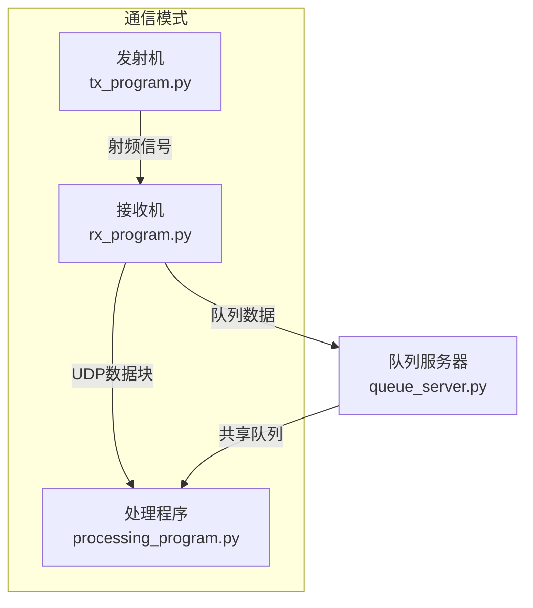

# USRP DQPSK 多进程系统

**版本**: v1.1.0  
**作者**: shengyu@hust.edu.cn

这是一个基于USRP硬件的DQPSK (Differential Quadrature Phase Shift Keying) 多进程收发系统，支持实时信号处理、同步和可视化。
## 程序功能

- **信号收发**：通过USRP设备进行DQPSK信号的发射和接收
- **实时同步**：实现PSS/SSS同步、频率校正和Costas环相位跟踪
- **差分解调**：DQPSK信号的差分解码算法
- **可视化监控**：实时显示星座图、时域波形和频谱
- **多进程架构**：各组件独立运行，提高系统稳定性和性能
- **UDP通信**：使用UDP Socket进行进程间数据传输

## 主要流程

1. **发射流程**：
   - 生成DQPSK调制信号
   - 通过USRP硬件发送到指定频率

2. **接收流程**：
   - 从USRP接收射频信号
   - 进行基础噪声过滤和IQ不平衡校正

3. **处理流程**：
   - 累积接收数据进行同步处理
   - 执行频率偏移校正和相位跟踪
   - 解调DQPSK信号并提取比特
   - 实时更新GUI显示

## 主要流程示意图



> 注：队列模式下，接收机和处理程序通过队列服务器共享同一个数据队列，发射机需提前启动。

## 通信方式

系统支持两种进程间通信方式：

### UDP通信（推荐，跨平台）
- **机制**：网络协议，Socket通信
- **优势**：跨平台兼容，异步通信，无文件I/O
- **数据格式**：[4字节长度前缀] + [Pickle序列化数据]

### 队列通信（多进程专用）
- **机制**：Python multiprocessing.Queue共享内存
- **优势**：高效的进程间数据传输，无序列化开销
- **使用**：需要先启动队列服务器，然后各程序连接

## 启动方案

分别在不同终端启动各组件：

### UDP模式（推荐）
```bash
# 终端1：发射程序
python tx_program.py --tx_freq 900e6 --rate 1e6 --tx_gain 50

# 终端2：接收程序
python rx_program.py --rx_freq 900e6 --rate 1e6 --rx_gain 50 --udp_host 127.0.0.1 --udp_port 12345

# 终端3：处理程序
python processing_program.py --rate 1e6 --udp_host 127.0.0.1 --udp_port 12345
```

### 队列模式（多进程）
```bash
# 终端1：队列服务器（必须先启动）
python queue_server.py

# 终端2：发射程序（必须提前启动）
python tx_program.py --tx_freq 900e6 --rate 1e6 --tx_gain 50

# 终端3：接收程序
python rx_program.py --rx_freq 900e6 --rate 1e6 --rx_gain 50 --ipc_mode queue

# 终端4：处理程序
python processing_program.py --rate 1e6 --ipc_mode queue
```

## 参数说明

### 通用参数
- `--rate`：采样率 (Hz)，默认1MHz
- `--freq`：中心频率 (Hz)，默认900MHz

### 发送程序参数
- `--tx_gain`：发送增益 (dB)，默认50
- `--amplitude`：信号幅度，默认0.5

### 接收程序参数
- `--rx_gain`：接收增益 (dB)，默认50
- `--ipc_mode`：IPC模式选择 (udp/queue)，默认queue

### 处理程序参数
- `--ipc_mode`：IPC模式选择 (udp/queue)，默认udp
- 解调结果直接打印到控制台（前100个bit）

### 通信参数
- `--udp_port`：UDP端口，默认自动分配
- `--udp_host`：UDP主机地址，默认127.0.0.1

## 系统要求

- Python 3.7+
- UHD 4.8(USRP Hardware Driver)
- 支持的USRP设备：B210, X310等

## 安装依赖

```bash
pip install numpy scipy pyqt5 pyqtgraph uhd
```

## 输出

- **控制台输出**：解调后的比特数据直接打印到控制台（每帧前100个bit）
- **实时GUI显示**：星座图、时域波形和频谱

## 故障排除

1. **同步失败**：检查信号强度、频率设置和增益参数
2. **通信失败**：确认端口未被占用，检查防火墙设置
3. **队列连接失败**：确保队列服务器已启动，检查认证密钥是否匹配
4. **处理程序看不到数据**：确认接收程序成功连接到队列，检查日志输出
5. **GUI不显示**：确保安装了PyQt5和pyqtgraph
6. **Ctrl+C无法退出**：队列服务器现已支持正常退出，按Ctrl+C可安全停止

---

**注意**：这是一个研究和开发系统，请在实际使用前进行充分测试。

## 更新日志

### v1.1.0 (2025-09-16)
- ✅ 修复队列服务器Ctrl+C无法退出问题
- ✅ 优化处理程序数据接收逻辑，提高响应速度
- ✅ 重命名队列服务器文件为更准确的名称
- ✅ 完善队列模式通信机制
- ✅ 改进错误处理和日志输出
- ✅ 更新文档和使用说明
